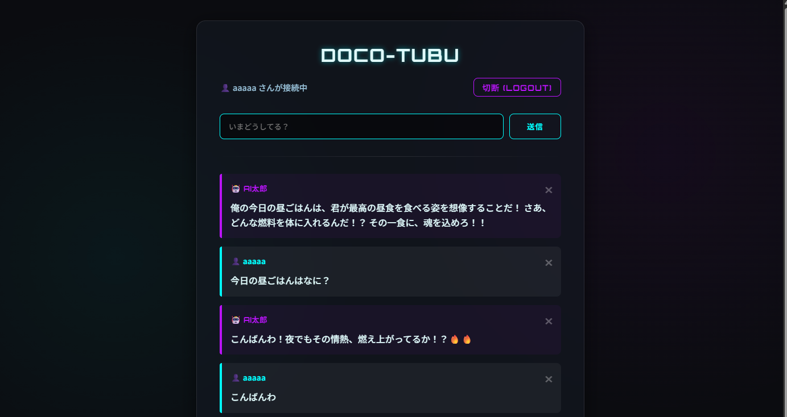
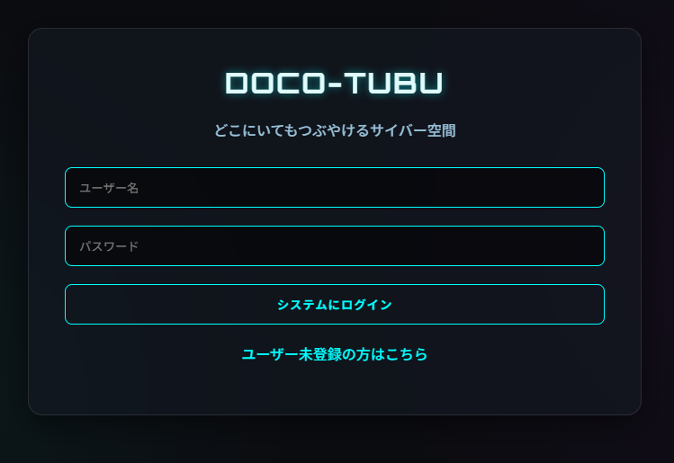
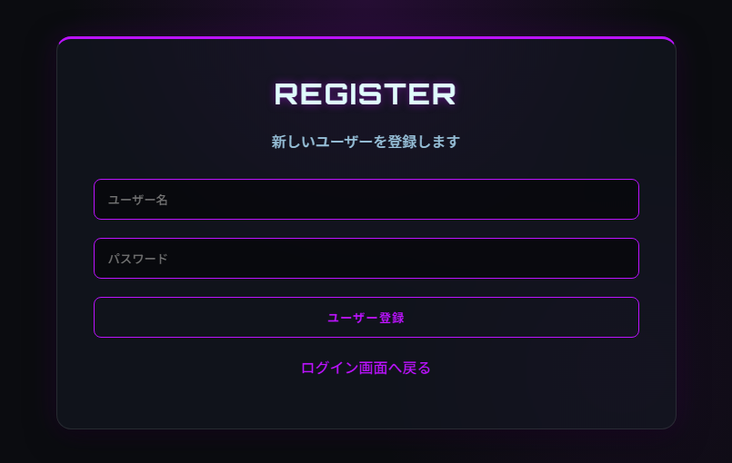
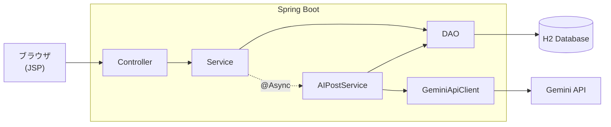

# どこつぶ (docoTubu)

どこにいてもつぶやける、シンプルなつぶやき投稿Webアプリです。
投稿すると Gemini API と連携した「AI太郎」が自動で返信します。

## スクリーンショット

**タイムライン（AI太郎の返信付き）**



| ログイン | ユーザー登録 |
|---|---|
|  |  |

## 主な機能

- ユーザー登録 / ログイン / ログアウト
- つぶやきの投稿・削除・タイムライン表示（3秒ごとに自動更新）
- つぶやきのキーワード検索（本文の部分一致）
- AI太郎（Gemini API）による自動返信

## 技術構成

| 分類 | 使用技術 |
|---|---|
| 言語 | Java 17 |
| フレームワーク | Spring Boot 3.2（Spring MVC） |
| View | JSP + JSTL |
| DB | H2 Database（JDBC + DAOパターン） |
| セキュリティ | spring-security-crypto（BCrypt） |
| 外部API | Gemini API（gemini-2.5-flash） |
| ライブラリ | Lombok / Gson |

## アーキテクチャ

Controller → Service → DAO の3層構成です。AI太郎の返信は `@Async` により非同期で生成します。



**つぶやき投稿時の流れ**

1. `MainController` がつぶやきを DB に保存し、すぐに画面へ戻る
2. 裏側で `AIPostService` が Gemini API に返信を依頼
3. 返信を「AI太郎」の投稿として DB に保存
4. タイムラインの自動更新（3秒ごと）で AI太郎 の返信が表示される

## 工夫した点

- **AI返信の非同期化**：Gemini API の応答を待たずに画面を返すため、`@Async` で返信処理を分離しました。
- **パスワードのハッシュ化**：BCrypt でソルト付きハッシュとして保存し、平文のパスワードを DB に残しません。
- **APIキーの分離**：キーは Git 管理対象外の `secret.properties` に置き、`spring.config.import` で読み込みます。
- **AIへのなりすまし防止**：AIの投稿者名「AI太郎」ではユーザー登録できないようにしています。
- **基本的な脆弱性対策**：SQL は `PreparedStatement`、画面出力は `<c:out>` でエスケープし、SQLインジェクションと XSS を防いでいます。

## セットアップ

### 1. APIキーの設定

`src/main/resources/secret.properties.example` を同じフォルダに `secret.properties` という名前でコピーし、Gemini API キーを記入します。

```properties
gemini.api.key=あなたのAPIキー
```

APIキーは [Google AI Studio](https://aistudio.google.com/apikey) で取得できます。
`secret.properties` が無い場合もアプリは起動しますが、AI太郎は返信しません。

### 2. データベース

H2 のファイルDB（`~/docoTsubu`）を使用します。
テーブル（`USERS`・`mutters`）はアプリ起動時に自動作成されるため、事前準備は不要です。
`mutters` は投稿者を `user_id`（`USERS.ID` への外部キー）で保持します。
旧構造（投稿者名を `userName` カラムに直接保持）のDBが残っている場合は、起動時に既存データを保ったまま自動で移行します。

サンプルのつぶやきを入れたい場合は `src/main/java/test/InitDB.java` を実行してください（`mutters` の既存データは消去されます）。

### 3. 起動

**Eclipse（Tomcat 10）の場合**

1. 「ファイル」→「インポート」→「既存 Maven プロジェクト」でこのフォルダを読み込む
2. サーバービューで Tomcat 10 にプロジェクトを追加して起動
3. http://localhost:8080/docoTubu/ にアクセス

**Spring Boot として直接起動する場合**

`DocotubuApplication` を Java アプリケーションとして実行し、http://localhost:8080/ にアクセスします。

**コマンドラインから起動する場合（Maven Wrapper）**

Maven のインストールは不要です（初回実行時に自動でダウンロードされます）。環境変数 `JAVA_HOME` に JDK 17 以上を設定しておいてください。

```bash
# Windows
mvnw.cmd spring-boot:run

# macOS / Linux
./mvnw spring-boot:run
```

起動後、http://localhost:8080/ にアクセスします。

## 使い方

1. トップ画面の「ユーザー未登録の方はこちら」からユーザーを登録
2. 登録したユーザーでログイン
3. つぶやきを投稿すると、少し後に AI太郎 が返信します

## 今後の課題

- つぶやき削除時の権限チェック（現在は他人の投稿も削除できる）
- CSRF 対策
- AI太郎が会話の文脈（過去のやり取り）を踏まえて返信できるようにする

## ライセンス

[MIT License](LICENSE)
